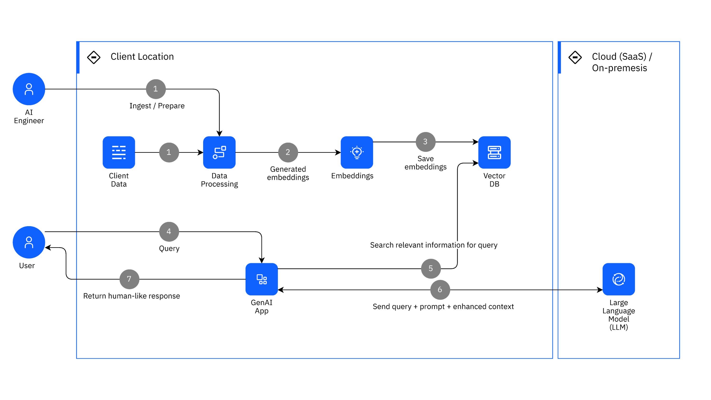
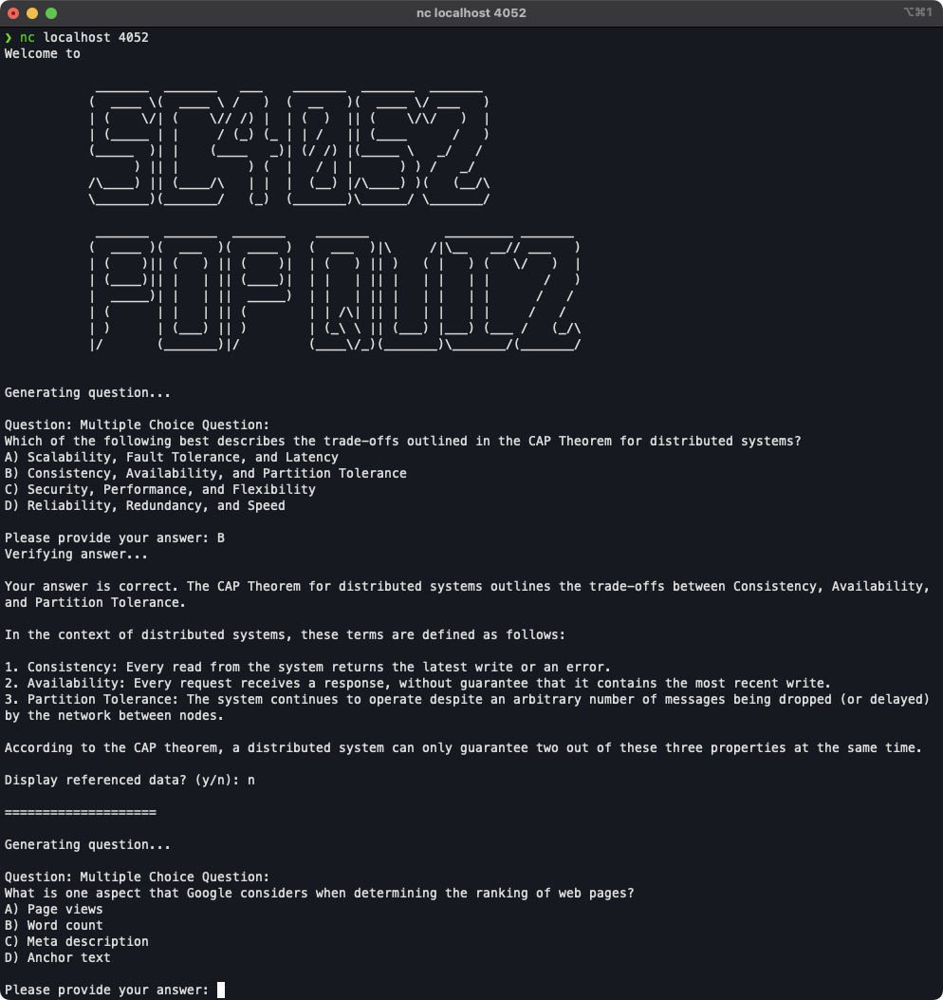

# Introduction

Building a high-quality quiz generator platform focused on lecture-specific topics with the help of generative AI requires a constant knowledge base for reference. This ensures that the questions generated by the AI align closely with the content taught in class.

# Evaluating the Effectiveness of using only Gen-AI for Quiz Generation

Employing Google Gen-AI, as detailed in <https://codelabs.developers.google.com/cloud-genai#0>, for generating quizzes might not yield precise questions related to cloud computing that fall within the SC4052 course scope. This limitation becomes apparent when considering how Gen-AI generates content. For instance, if given a prompt like "Generate a question about cloud computing" without further context, Gen-AI relies on its training data or the internet for information. Consequently, the questions it generates might not align with the material covered in class.

### Example:

> Prompt: Generate a question about cloud computing

> Gen-AI Response: What are the key performance indicators (KPIs) that measure the efficiency and effectiveness of cloud computing resources? for businesses?

While these questions are valid within the broader field of cloud computing, they may stray from the specific focus areas of the SC4052 course, underscoring the challenge of aligning AI-generated content with targeted educational objectives.

## Trivial solution?

The proposition of inserting the entire lecture slides as context alongside the prompt "Generate a question about cloud computing based on the provided context" presents a potential solution. However, this approach comes with significant considerations. Firstly, the feasibility of including all seven lecture slides in a single prompt is uncertain, given potential token limitations on input length. Furthermore, even if technically feasible, this method will be costly for every API calls. Additionally, the broad scope provided by the entire set of lecture slides might lead to the generation of irrelevant or inaccurate questions, a phenomenon known as hallucination, thereby compromising the quality of the quiz content.

### Example:

> Prompt: … Lecture 1-7 slides in text … Generate a question about cloud computing based on the provided context

Attempting to process the given prompt results in the error message "Request contains an invalid argument." This outcome is expected, as the prompt requires 52,161 tokens to be processed, surpassing the capacity of the `Gemini-1.0-pro-001` model, which can only handle up to 32,760 tokens.

The methodology for converting lecture PDFs to text will be elaborated on later in this document.

To comply to the token limit, content from lectures 5-7 will be excluded, reducing the token count to 29,816 and thus staying within the model's capacity.

> Prompt: … Lecture 1-4 slides in text … Generate a question about cloud computing based on the provided context

> Gen-AI Response: How does cloud computing leverage virtualization to facilitate resource management and elasticity in its infrastructure?

Based on these responses, it's evident that the questions generated are slightly more aligned with the material covered in the lectures. But can we do better?

## Introducing **Retrieval-Augmented Generation (RAG)**

Retrieval-Augmented Generation (RAG) enhances language models by integrating external information search and usage, improving text accuracy, detail, and relevance. It operates in two steps: first, identifying relevant external data, and then merging this with existing knowledge to enhance text output. RAG is particularly effective for creating contextually relevant and up-to-date content in quiz generators for lecture-specific topics, as it can dynamically incorporate detailed, accurate information from a continuous knowledge base, ensuring quizzes remain relevant and current. A diagram of RAG Conceptual Architecture is shown in figure 1 in the appendix



# Building a Better Quiz Generator with RAG

Tools and AI models used:

-   gemini-1.0-pro-vision-001 by Google
-   text-embedding-ada-002 by OpenAI
-   gpt4 & gpt-3.5-turbo by OpenAI
-   [Qdrant Vector Database](https://qdrant.tech/)

### Step 1: Extraction of lecture content

The Python tool PyPDF2 serves as the initial choice for converting PDF files into text. However, it's important to note that this method may not capture all elements of the document. Specifically, slides that include images or diagrams might not be accurately translated into text, which could result in the omission of some data.

This issue can be effectively addressed through the application of multimodal artificial intelligence (AI) that possesses visual capabilities. Running the python script, `pdf_to_text_generation.py` (detailed in the appendix), processes all lecture PDF files by segregating them into individual pages first. Subsequently, it employs a generative multimodal AI with visual capabilities to extract textual content from these pages. For each page, the content is converted into text utilizing a predetermined generative model, specifically `gemini-1.0-pro-vision-001`. The text generated from the same lecture is then aggregated into a singular text file. This approach ensures that the text extracted from the lecture PDFs closely aligns with the original content, ensuring minimal loss of information.

> Prompt:
>
> document, """
>
> Given a document, your task is to extract the text from the document
>
> -   If there is a diagram, describe and elaborate the diagram
>
> -   Do not change any content
>
> -   Output should be text only, and not in markdown or any other format
>
> -   Clean up the text such that it is readable and coherent
>
> """

Note that `document` refers to the single paged lecture slide.

The prompt instruct the model to extract content from the slides without modifying any information. Should there be any diagrams or images within the slide, the model is tasked to interpret and convert these visual elements into a descriptive text format, thereby ensuring a comprehensive textual representation of the original content.

### Step 2: Building a knowledge base

After compiling the textual representations extracted from lecture slides, the subsequent imperative, though discretionary, involves meticulous manual scrutiny and quality control to ensure readability and coherence across the extracted text. While Artificial Intelligence (AI) can aid in this process given the appropriate prompt, its results have exhibited inconsistency.

Following this initial phase, the subsequent task entails manual segmentation of the texts into smaller chunks of approximately 200 words each. It is imperative that the content within each chunk maintains coherence to a particular subtopic. While AI could potentially assist in this segmentation process, its outcomes have proven variable and unreliable.

Executing the script `text_embedding_to_qdrant.py` (detailed in the appendix), outlined in the appendix, allows for the processing of text segments, transforming them into text embeddings using OpenAI's `text-embedding-ada-002` model. These embeddings capture the core semantic meaning of the text in a vector format, ideal for conducting similarity searches. Following this, each piece of text and its corresponding embedding are upserted into a designated collection within the Qdrant vector database. This method ensures optimised storage and swift retrieval of texts that are semantically akin, housed within the Qdrant vector database, which serves as the foundation for our quiz knowledge base.

> A vector database, is a type of database designed to store, manage, and retrieve vector data. Vectors in this context are arrays of numbers that represent data points in a multidimensional space. This kind of database is especially useful for applications that involve machine learning, artificial intelligence, and similarity searches.

### Step 3: Building a quiz generation platform

Upon completing the setup of the knowledge base, it serves as a foundational reference for the generation of questions using generative AI. The initiation of the quiz platform is triggered by the execution of the `app.py` script, as outlined in the appendix. To enhance the diversity of the questions generated, the application selects a main topic at random from lectures 1 through 7. This selected main topic is subsequently submitted to the `GPT-3.5-turbo` model to solicit recommendations for subtopics.

> Prompt: "Recommend and describe one subtopic that is related to {topic}"

Note that `{topic}` refers to the randomly chosen main topic

```python
main_topics = [
    'Basics, IaaS, PaaS, SaaS', 'Data Center Networking–Basics, Topology',
    'Virtualization in Cloud', 'Cloud CPU Scheduling', 'Crowdsourcing in Cloud',
    'Cloud Security', 'CAP Theorem', 'PageRank Algorithm'
]
```

The recommendations obtained are then processed through the `text-embedding-ada-002` model to create a vector representation. This vector serves as a search query within the Qdrant vector database, which constitutes our knowledge base. The database returns the top three results, which are merged into a single context. This context is then used by the generative AI as a reference for question generation.

With the context established, a request is made to the `GPT-3.5-turbo model` to generate either a multiple-choice question (MCQ) or a short-answer question. The generation is based exclusively on the provided context, ensuring that the source of truth directly informs the question posed.

> Prompt: "{context}\\nBased on the context provided above, generate only 1 multiple choice question or 1 short answer question. Do not provide the answer. Quiz takers are not aware of the context provided. Never ask the same question"

Note that `{context}` refers to the text(s) retrieved from the vector database

The prompt instruct the model to generate one MCQ or short answer question based on solely the context provided as source of truth.

The question generated is displayed on the user screen, awaiting the user's response. Upon receiving the user's answer, it is evaluated by a validation function that employs the GPT-4 model to verify the proposed solution. Should the user's response be incorrect, the generative AI furnishes the correct answer along with an explanatory note.

> Prompt: "My answer is: {answer}\\nIf wrong, provide the correct answer and further elaborate on the concept."

Note that `{answer}` refers to the answer provided by the user

This process iterates, presenting the user with new questions for each cycle. The history of interactions between the application and OpenAI's GPT models is recorded to enhance the generation of subsequent questions and preventing repetition of previously asked questions.

After careful consideration, it has been determined that the development of a web interface for this project is not essential to demonstrate the capabilities of quiz generation utilizing Retrieval-Augmented Generation (RAG). Therefore, to facilitate remote connectivity and interaction with the application, a terminal-based approach employing `netcat` has been adopted. For a practical illustration of this setup, please refer to the screenshot presented in the appendix as Figure 2.

# Conclusion

Constructing a quiz generation platform that relies solely on generative AI, while innovative, encounters limitations due to the expansive and unconstrained knowledge base of such AI systems. This unrestricted access to information can lead to the creation of questions that diverge significantly from the intended course content, potentially confusing learners and diluting the educational objectives. To mitigate this challenge, establishing a dedicated knowledge base for the generative AI to reference is crucial. This ensures that the questions generated remain aligned with the specific scope of the course, maintaining relevance and coherence in the learning material presented.

---

# Appendix


